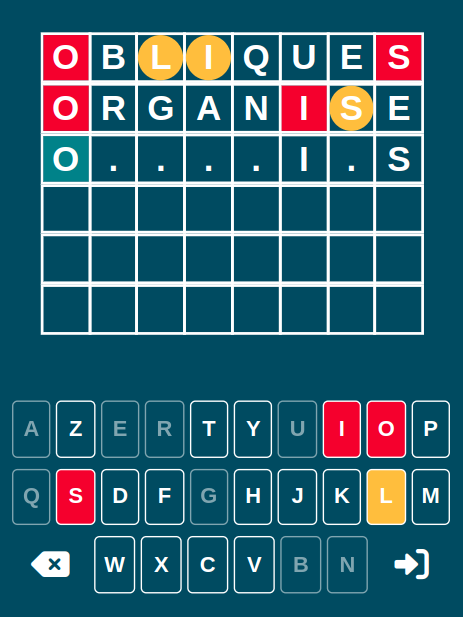

# Jeux Motus
## Description du projet

Le but de ce projet est de créer un jeu de MOTUS.

## Objectif du jeu

Le joueur a droit à ***6 essais*** pour découvrir le mot mystère. A chaque essai, les cases des lettres se colorent de la façon suivantes:

- rouge la lettre est correctement placé.
- jaune la lettre est bien dans le mot, mais pas au bon endroit.
- ***non coloré*** la lettre n'est pas présente dans le mot.

***N.B.*** Le Layout doit s'adapter en fonction de la taille du mot utiliser, donc si le mot a découvrir est 4 lettre de long le plateau devra faire 4 cases par ligne (avec x nombre de ligne représentant le nombre d'essai possible).

## Layout du jeu

Sous la grille du mot se trouve un clavier reprenant chaque indice: les lettres sont colorées suivant le code couleur expliqué précédemment, ***les lettres encore non utilisés sont en blanc***, ***les lettres inutiles sont grisées***.

***N.B.*** l'utilisateur devra pressé les touches du clavier pour faire fonctionner le jeux dans un premier temps (possible amélioration pour une V2 d'autoriser l'utilisateur à utiliser son clavier)

## Liste de mot

La liste de mots est crée en avance et manuellement dans le programme, je récupèrerais une liste de mot sur internet que je sauvegarderais dans un fichier JSON.

***N.B.*** Possible amélioration pour le future soit trouver une api qui met a disposition des mots en français, soit stocker des mots dans une DB.

## Différent mode de jeu

### Compétitif

Mode de jeu en ***5 manches***

- la première manche découvrir un mot en 5 lettres
- la deuxième manche décourvrir un mot en 6 lettres
- la troisième manche découvrir un mot en 7 lettres
- la quatrième manche découvrir un mot en 8 lettres
- la cinquième manche découvrir un mot en 9 lettres

Si le joueur échoue a trouver un mot alors Game Over et il doit recommencer (un score sera calculer sur le nombre de lettre que le joueur aurait utiliser voir Score section)

Un chronomètre est lancé dés le début de la partie compétitif plus le temps total est bas plus le score sera élevé (voire Score section)

3 niveaux de difficulté sont présent:

- ***facile*** Le joueur a droit à 10 essais
- ***normal*** Le joueur a droit à 8 essais
- ***difficile*** Le joueur a droit à 6 essais

***N.B.*** Le tableau contenant le nombre de ligne doit donc s'adapter pour pouvoir accueillir 6,8 ou 10 lignes, ou alors le tableau possède un nombre fixe de ligne en tout temps (imaginons 6) et lorsque l'utilisateur choisi le mode facile alors lorsque l'utilisateur atteint la chance 7 l'écran est remis a jour et 4 nouvelles lignes sont chargé au lieu de 6.

### Jeu libre

Le joueur pourra choisir la longueur du mot à trouver et la difficulté (identique au mode compétitif) un seul mot sera à chercher et aucun score ne sera calculé.

## Déroulement d'une partie

1) l'utilisateur arrive sur l'application et devra tout d'abord choisir un pseudo
2) une fois le pseudo choisi, un second écran est charger contenant un choix entre le mode compétitif et le mode libre (avec une brève explication du défis pour chaque mode)
3) une fois le mode choisi l'utilisateur chois la difficulté du jeu
4) Si l'utilisateur choisi
   1) compétitif alors le jeux charge une liste de mot et prépare le layout en respectant règles et condition défini préalablement.
   2) libre l'utilisateur choisi la grandeur d'un mot et ensuite le layout est charger en respectant les règles du mode choisi
5) Si l'utilisateur:
   1) Perd alors écran proposant de rejouer, l'utilisateur aura le choix de rejouer (avec les même paramètres) ou de retourner à l'écran de sélection de mode (donc reset des paramètres de la partie)
   2) Gagne alors écran de score (voire Score) ensuite lien pour proposer soit au joueur de rejouer avec les mêmes paramètres ou retour a l'écran de sélection de mode (donc reset des paramètres de la partie)

## Score

Les points sont comptés de la façon suivante :

- 10 point pour le mot trouvé, 5 point en plus pour le mot trouver (en plus des points attribuer par lettre).
- 5 points pour une lettre bien placée.
- 1 point par lettre mal placée.

Il y aura également des points bonus en fonction de la rapidité, une partie ne sera pas limité dans le temps mais chaque manche aura une durée maximal de 30 secondes.

- le mots est trouvé en moins de 10% du temps imparti alors bonus de 20 point
- le mots est trouvé en moins de 20% du temps imparti alors bonus de 15 point
- le mots est trouvé en moins de 35% du temps imparti alors bonus de 10 point
- le mots est trouvé en moins de 50% du temps imparti alors bonus de 5 point
- le mots est trouvé en plus de 50% du temps imparti ou hors de la limite de temps alors pas de point bonus.

exemple : https://motus.absolu-puzzle.com/index.php